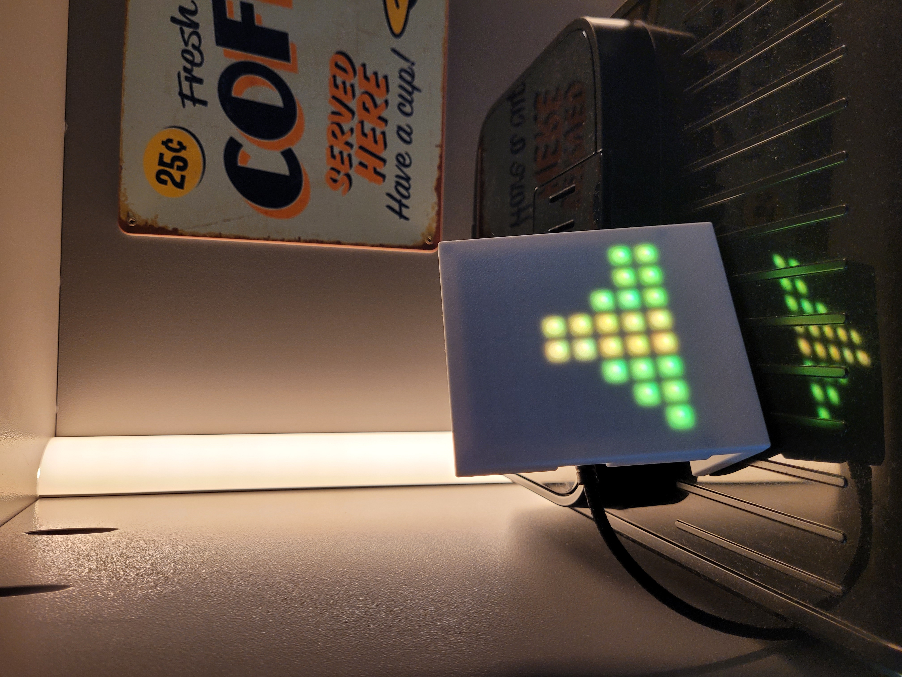

# 8x8 LED Tibber Price Indicator (Fork)

This repository is a fork of Till-83’s original 8x8 LED matrix Tibber price indicator project.

## What is this?

A compact ESP8266-based LED display that visualizes dynamic <u>hourly</u> electricity prices from Tibber using an 8x8 WS2812B (NeoPixel) LED matrix.

- First column → current hour
- Next 7 columns → upcoming 7 hours
- High / Low → maximum and minimum price within the next 24 hours
- Colors represent price levels as provided by the Tibber API

This fork includes PCB mapping, price level fixes and extended build instructions.

---

## Changes in this Fork

- Fixed PCB mapping and orientation to work with AZ-Delivery U64 LED matrix panel module
- Fixed link between Tibber price level and colour
- Added blue colour for negative total price
- Expanded step-by-step build and compilation instructions
- Added custom 3D-printable enclosure variant

---

## Hardware Requirements

- AZ-Delivery D1 Mini NodeMcu with ESP8266-12F WLAN Module CH340G ([amazon.nl](https://www.amazon.nl/dp/B0754N794H))
- AZ-Delivery U64 LED matrix panel module ([amazon.nl](https://www.amazon.nl/dp/B078HYP681))
- Micro-USB cable for power ([action.nl](https://www.action.com/nl-nl/p/3008000/))
- Optional: 3D printed enclosure ([printables.com](https://www.printables.com/model/1617300-8x8-wled-matrix-andor-energy-price-indicator))

Estimated electronics cost: ~15...20 EUR

---

## Wiring

Connect the LED matrix:

- 5V → 5V
- GND → GND
- Data → D3 (default in code)

⚠ Always verify voltage compatibility of your LED matrix and board.

---

## Software Requirements

- Arduino IDE 2.x recommended
- ESP8266 board package installed (check your board's manual)
- Required libraries:
  - ArduinoJson (Benoit Blanchon)
  - Adafruit GFX (install all)
  - Adafruit NeoPixel

---

## Setup Instructions

1. Install Arduino IDE.
2. Install required libraries.
3. Install board support via **Boards Manager**.
4. Open the project in Arduino IDE.
5. Edit `settings.h`:
   - Insert your WiFi credentials
   - Insert your Tibber API key
6. Select board: *LOLIN(WEMOS) D1 R2 & mini* (or your ESP8266 variant).
7. Select correct COM port.
8. Compile and upload.

---

## Enclosure

A custom enclosure variant is available:  
  
<Your Printables link here>

The enclosure is based on a remix of an existing design on Printables.
Credits to the original designer.

---

## Credits

Original project by Till-83: [link](https://github.com/Till-83/Tibber_Price_Monitor)

Original enclosure concept by Hatrick3D: [link](https://www.printables.com/de/model/908102-8x8-led-matrix-display-as-energy-price-indicator-f)